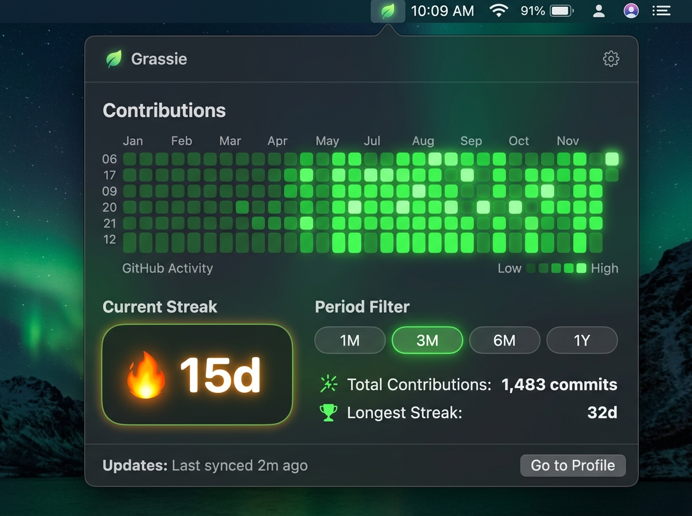

# 🌱 Grassie — macOS 네이티브 GitHub 잔디 트래커

[](https://apple.com)
[](https://swift.org)
[](LICENSE)
[](Casks/grassie.rb)

> **언어**: [English](README.md) | [한국어](README.ko.md) | [日本語](README.ja.md) | [中文](README.zh.md)

**Grassie(그래시)**는 macOS 상단 메뉴바에서 실시간으로 깃허브 커밋 잔디 격자와 연속 커밋(Streak) 성과를 한눈에 확인할 수 있는 초고속 네이티브 macOS 메뉴바 애플리케이션입니다.

---

<p align="center">
  
  <br />
  <br />
  
</p>

---

## ✨ 핵심 기능

- 💧 **Liquid Glass UI**: macOS 서리 유리 블러(`NSVisualEffectView`)와 액체 입체 광원이 어우러진 프리미엄 디자인
- 🟩 **실시간 3x3 미니 잔디 상태바 아이콘**: 최근 9일간의 실제 커밋 레벨이 상단 메뉴바 아이콘의 9개 네모칸에 실시간 초록색으로 렌더링
- 🌱 **동적 연속 달성 이모지 엔진**: 커밋 달성 기간에 따라 상태바 이모지 자동 진화 (`0일 🌱` ➡️ `1-6일 🌿` ➡️ `7-29일 🔥` ➡️ `30-99일 🚀` ➡️ `100일+ 👑`)
- 🗓️ **기간 필터 반응형 격자**: `1M`, `3M`, `6M`, `1Y` 버튼 클릭 시 잔디 셀 크기가 자동으로 확대/축소되며 팝오버 창 높이가 부드럽게 연동
- 🎨 **외관 테마 모드**: 시스템 자동(macOS 다크/라이트 추종), Liquid Dark, Liquid Light 지원
- 🌐 **4개국어 완벽 지원**: 영어(English), 한국어, 일본어(日本語), 중국어(中文) 실시간 다국어 지원
- 🚀 **macOS 로그인 시 자동 실행**: 네이티브 `SMAppService` 연동으로 시스템 부팅 시 무소음 자동 구동

---

## 💻 설치 방법

### 방법 1: Homebrew 설치 (단일 저장소 권장)
```bash
brew tap mrKangHo/Grassie https://github.com/mrKangHo/Grassie
brew install --cask grassie
```

### 방법 2: 소스코드 직접 빌드
```bash
git clone https://github.com/mrKangHo/Grassie.git
cd Grassie
swift build -c release
open Grassie.app
```

---

## 🛠️ 사용 방법
1. 응용 프로그램 폴더 또는 메뉴바에서 **Grassie**를 실행합니다.
2. 팝오버 상단의 **⚙️ 설정 아이콘**을 누릅니다.
3. 본인의 **GitHub Username**을 입력하고 **변경사항 저장**을 클릭합니다.
4. 상단 메뉴바에서 실시간으로 잔디와 연속 커밋 달성을 즐기세요!

---

## 📄 라이선스
MIT License에 따라 배포됩니다. 자세한 내용은 `LICENSE`를 참고하세요.
