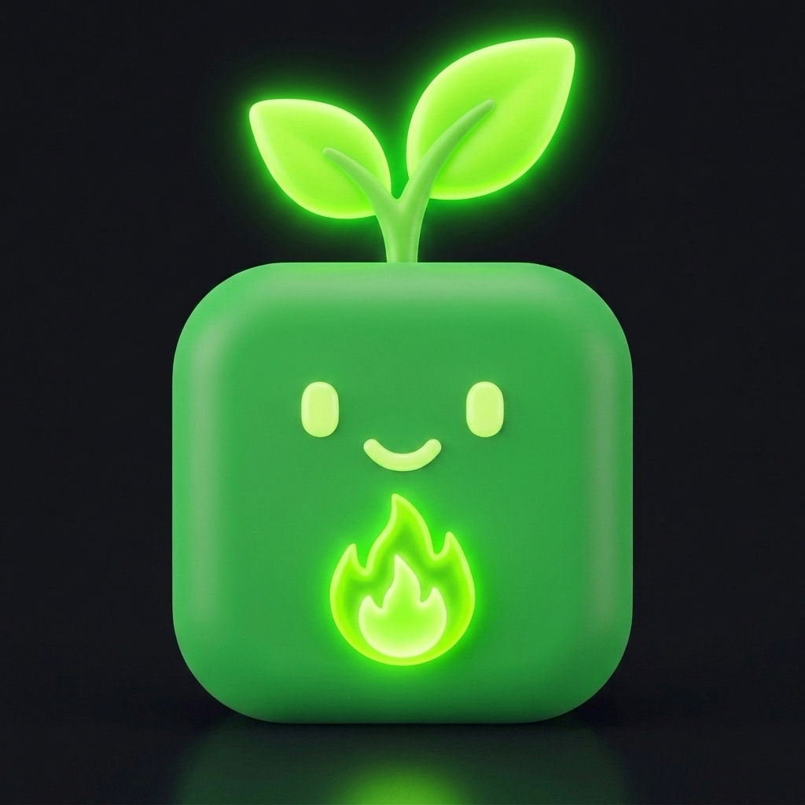
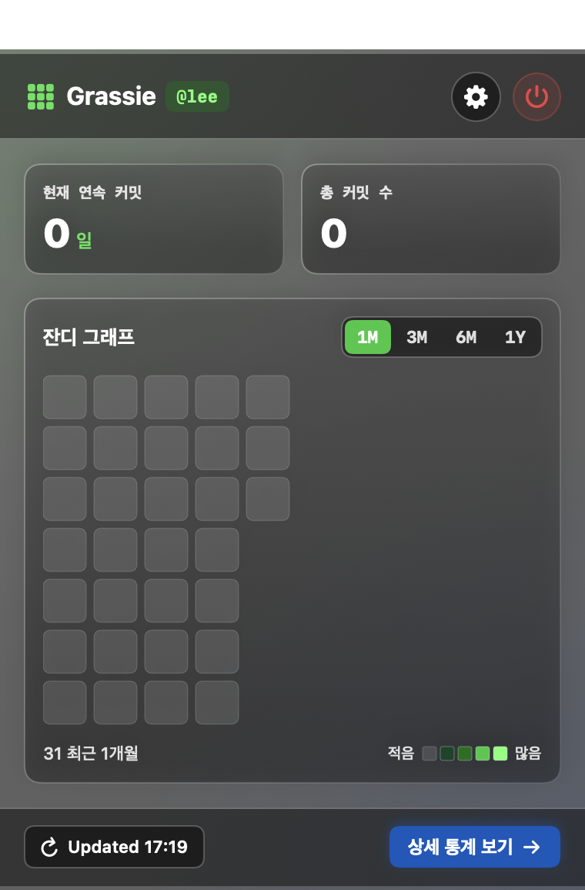

🇰🇷 [한국어](README.md) | 🇺🇸 [English](README.en.md) | 🇯🇵 [日本語](README.ja.md) | 🇨🇳 [中文](README.zh.md)

<p align="center">
  
</p>

<h1 align="center">🌱 Grassie</h1>

<p align="center">
  <b>macOS 네이티브 GitHub 잔디 & 연속 커밋(Streak) 트래커</b><br/>
  SwiftUI & AppKit 기반으로 메뉴바에서 실시간 커밋 현황을 한눈에 확인
</p>

<p align="center">
  
</p>

## ✨ 핵심 기능

- 💧 **Liquid Glass UI**: macOS 서리 유리 블러(`NSVisualEffectView`)와 액체 입체 광원이 어우러진 디자인
- 🟩 **실시간 3x3 미니 잔디 상태바 아이콘**: 최근 9일간의 실제 커밋 레벨이 상단 메뉴바 아이콘의 9개 격자에 실시간 렌더링
- 🌱 **동적 연속 달성 이모지 엔진**: 커밋 달성 기간에 따라 상태바 이모지 자동 진화 (`0일 🌱` ➡️ `1-6일 🌿` ➡️ `7-29일 🔥` ➡️ `30-99일 🚀` ➡️ `100일+ 👑`)
- 🗓️ **기간 필터 반응형 격자**: `1M`, `3M`, `6M`, `1Y` 버튼 클릭 시 기간별 잔디 격자 표시
- 🎨 **외관 테마 모드**: 시스템 자동, Liquid Dark, Liquid Light 지원
- 🌐 **4개국어 지원**: 한국어, English, 日本語, 中文 다국어 지원
- 🚀 **macOS 로그인 시 자동 실행**: 네이티브 `SMAppService` 연동 지원

## 💻 설치 방법 (Installation)

### Homebrew
```bash
brew tap mrKangHo/tap
brew install grassie
```

또는 전용 저장소 탭 사용:
```bash
brew tap mrKangHo/Grassie https://github.com/mrKangHo/Grassie
brew install --cask grassie
```

### 소스코드 직접 빌드
```bash
git clone https://github.com/mrKangHo/Grassie.git
cd Grassie
swift build -c release
open Grassie.app
```
