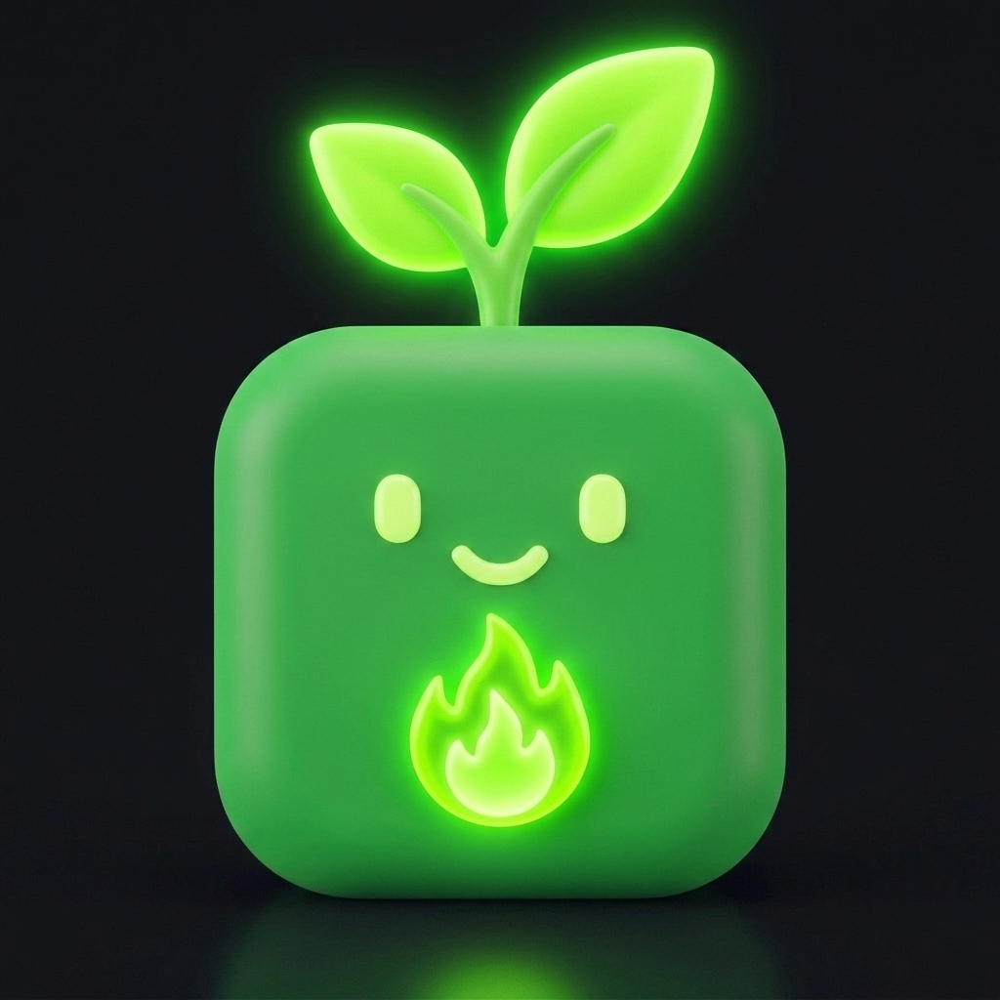

# 🌱 Grassie — Native macOS GitHub 贡献草图追踪工具

[](https://apple.com)
[](https://swift.org)
[](LICENSE)
[](Casks/grassie.rb)

> **语言**: [English](README.md) | [한국어](README.ko.md) | [日本語](README.ja.md) | [中文](README.zh.md)

**Grassie** 是一款基于 SwiftUI & AppKit 构建的高性能原生 macOS 菜单栏应用，让您可以在 Mac 顶部菜单栏实时追踪 GitHub 贡献绿草图与连续 Commit 动态。

---



## ✨ 核心特性

- 💧 **Liquid Glass UI**: 精美的 macOS 磨砂玻璃毛玻璃背景（`NSVisualEffectView`）与流体光影渐变。
- 🟩 **动态 3x3 菜单栏图标**: 菜单栏图标实时呈现您过去 9 天的真实 GitHub 贡献等级。
- 🌱 **动态 Streak 表情引擎**: 根据连续天数自动演进（`0天 🌱` ➡️ `1-6天 🌿` ➡️ `7-29天 🔥` ➡️ `30-99天 🚀` ➡️ `100天+ 👑`）。
- 🗓️ **自适应时间范围**: 自由切换 `1M`、`3M`、`6M`、`1Y` 视图，绿草方格大小与窗口高度自适应。
- 🎨 **外观模式**: 系统自动、Liquid Dark、Liquid Light。
- 🌐 **多语言支持**: 完整支持英语、韩语、日语和中文。
- 🚀 **macOS 登录自启动**: 原生 `SMAppService` 集成，开机静默后台启动。

---

## 💻 安装指南

### 方式 1: Homebrew 安装 (推荐)
```bash
brew tap mrKangHo/Grassie https://github.com/mrKangHo/Grassie
brew install --cask grassie
```

### 方式 2: 源码编译
```bash
git clone https://github.com/mrKangHo/Grassie.git
cd Grassie
swift build -c release
open Grassie.app
```

---

## 📄 开源协议
基于 MIT 协议开源，详见 `LICENSE`。
